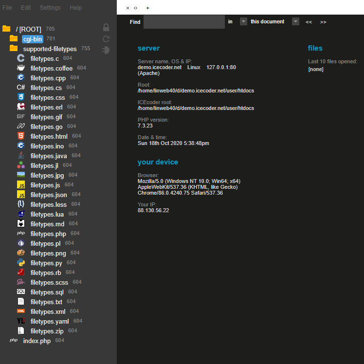

[](https://github.com/icecoder/ICEcoder)

[](https://hub.docker.com/repository/docker/griefed/icecoder)
[](https://hub.docker.com/repository/docker/griefed/icecoder)
[](https://hub.docker.com/repository/docker/griefed/icecoder)
[](https://hub.docker.com/repository/docker/griefed/icecoder)
[](https://github.com/Griefed/docker-ICEcoder)
[](https://github.com/Griefed/docker-ICEcoder)

ICEcoder is a browser based code editor, which provides a modern approach to building websites. By allowing you to code directly within the web browser, online or offline, it means you only need one program (your browser) to develop sites, plus can test on actual web servers. After development, you can also maintain the website easily, all of which make for speedy and smart development.

[](https://github.com/icecoder/ICEcoder)

---

Creates a Container which runs [icecoder's](https://github.com/icecoder) [ICEcoder](https://github.com/icecoder/ICEcoder), with [lsiobase/alpine](https://hub.docker.com/r/lsiobase/alpine) as the base image, as seen on [icecoder.net](https://icecoder.net/). A demo can be viewed [here](http://demo.icecoder.net/ICEcoder/)

The lasiobase/alpine image is a custom base image built with [Alpine linux](https://alpinelinux.org/) and [S6 overlay](https://github.com/just-containers/s6-overlay).
Using this image allows us to use the same user/group ids in the container as on the host, making file transfers much easier

## Deployment

### Pre-built images

```docker-compose.yml
version: '3.6'
services:
  icecoder:
    container_name: icecoder
    image: griefed/icecoder
    restart: unless-stopped
    volumes:
      - ./icecoder/code:/code
      - ./icecoder/config:/config
      - ./icecoder/data:/data
      - ./icecoder/plugins:/plugins
    environment:
      - GITURL=https://github.com/icecoder/ICEcoder.git
      - PUID=1000
      - PGID=1000
      - TZ=Europe/Berlin
    ports:
      - 8080:8080
```

## Configuration

Configuration | Explanation
------------ | -------------
[Restart policy](https://docs.docker.com/compose/compose-file/#restart) | "no", always, on-failure, unless-stopped
code volume | Contains GITURL repository.
config volume | Contains config files and logs.
data volume | Contains ICEcoder data like backups.
plugins volume | Contains all plugin files.
GITURL | Specify a GitHub repository to checkout on first run of the container.
TZ | Timezone
PUID | for UserID
PGID | for GroupID
ports | The port where the service will be available at.

## User / Group Identifiers

When using volumes, permissions issues can arise between the host OS and the container. [Linuxserver.io](https://www.linuxserver.io/) avoids this issue by allowing you to specify the user `PUID` and group `PGID`.

Ensure any volume directories on the host are owned by the same user you specify and any permissions issues will vanish like magic.

In this instance `PUID=1000` and `PGID=1000`, to find yours use `id user` as below:

```
  $ id username
    uid=1000(dockeruser) gid=1000(dockergroup) groups=1000(dockergroup)
```

### Raspberry Pi & building the image yourself

Using the [Dockerfile](https://github.com/Griefed/docker-ICEcoder/blob/lsiobase/alpine/Dockerfile), this container can be built and run on a Raspberry Pi.
I've tested it on a Raspberry Pi 3B.

#### docker-compose.yml

```docker-compose.yml
version: '3.6'
services:
  icecoder:
    container_name: icecoder
    build: ./icecoder/
    restart: unless-stopped
    volumes:
      - ./icecoder/code:/code
      - ./icecoder/config:/config
      - ./icecoder/data:/data
      - ./icecoder/plugins:/plugins
    environment:
      - GITURL=https://github.com/icecoder/ICEcoder.git
      - PUID=1000
      - PGID=1000
      - TZ=Europe/Berlin
    ports:
      - 8080:8080
```

1. Clone the repository: `git clone https://github.com/Griefed/docker-ICEcoder.git ./icecoder`
1. Prepare docker-compose.yml file as seen above
1. `docker-compose up -d --build icecoder`
1. Visit IP.ADDRESS.OF.HOST:8080
1. ???
1. Profit!
